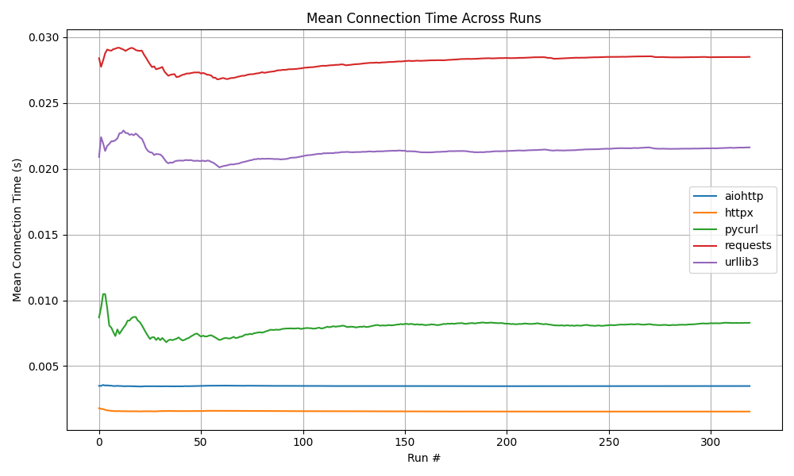
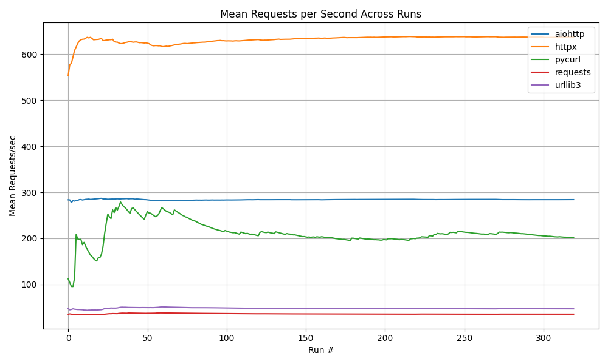
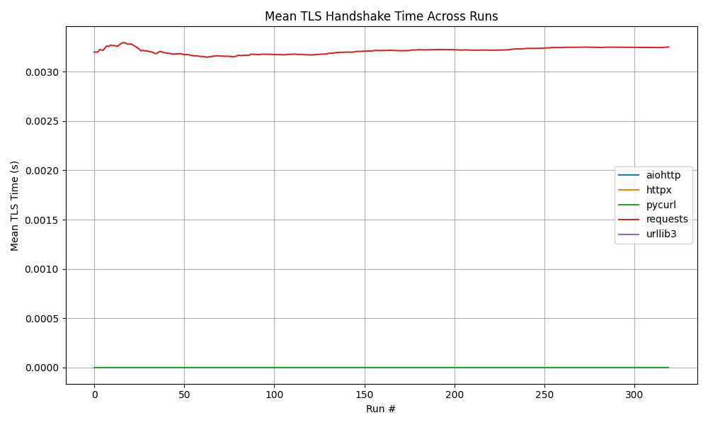
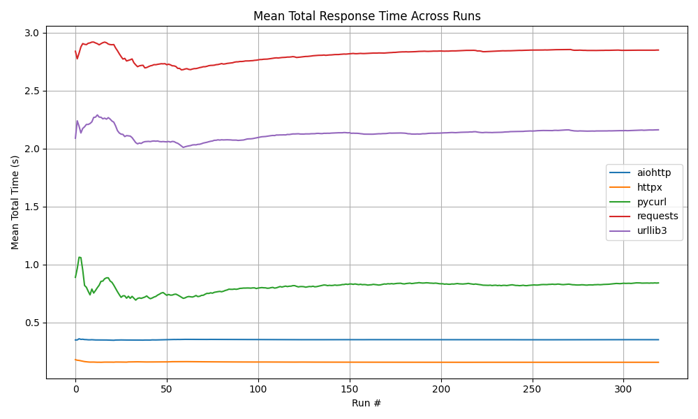

# 🐍 python-http-libraries-benchmark

This project benchmarks popular Python HTTP libraries to compare their performance across core networking metrics. The goal is to offer insights on how each library performs under real-world request loads.

---

## 📦 HTTP Libraries Benchmarked
This benchmark includes five widely-used Python HTTP libraries—requests, urllib3, httpx, aiohttp, and pycurl—chosen for their relevance, diversity, and real-world usage. requests is the most popular and beginner-friendly library, while urllib3 offers low-level control and powers requests internally. httpx and aiohttp provide modern asynchronous support for high-concurrency applications. Finally, pycurl wraps the high-performance C-based libcurl library, often used in system-level or legacy environments. Together, they represent a broad spectrum of HTTP client capabilities in Python, from ease of use to advanced performance tuning.

- [`aiohttp`](https://docs.aiohttp.org/)
- [`httpx`](https://www.python-httpx.org/)
- [`requests`](https://docs.python-requests.org/)
- [`urllib3`](https://urllib3.readthedocs.io/)
- [`pycurl`](http://pycurl.io/)

---

## 📊 Metrics Captured

Each library is evaluated using the following metrics:

- **Requests per Second (`req/sec`)**: Measures throughput. A higher number indicates the library handles more traffic efficiently.
- **Total Time**: Measures how long the library takes to complete a full batch of requests.
- **Average Connection Time**: Indicates the average time spent on establishing connections for each request.

These metrics are chosen to reflect practical usage in applications such as REST APIs, microservices, and integrations.

---

## 🎯 Benchmarking Strategy

To ensure fair and unbiased comparisons:

- Each run sends a fixed number of requests (`NUM_REQUESTS = 100`) to `https://postman-echo.com/get`.
- The script performs **6 complete benchmark runs**, where the first is used as warm-up and excluded from the CSV output.
- **Randomized Execution Order**: For every run, the order in which HTTP libraries are tested is randomized. This prevents any one library from benefiting from system or network caching effects due to consistent positioning.

---

## 📁 Output

Benchmark results are stored in `benchmark_results.csv`. Each row represents one full benchmarking round and includes:

- Start and end timestamps
- Requests per second, total duration, and average connection time for each library
- Number of requests executed

---

## ▶️ How to Run

1. **Install requirements:**

```bash
pip install -r requirements.txt
```
2. **Running the benchmark:**
```bash
python benchmark.py
```
3. **Running Analytics:**
```bash
python benchmark_analytics.py
```

## Results

### Environment:
OS: Windows 11 Home

Processor: Intel(R) Core(TM) i5-10400 CPU @ 2.90GHz   2.90 GHz

RAM: 12.0 GB

Location Type: Localhost





